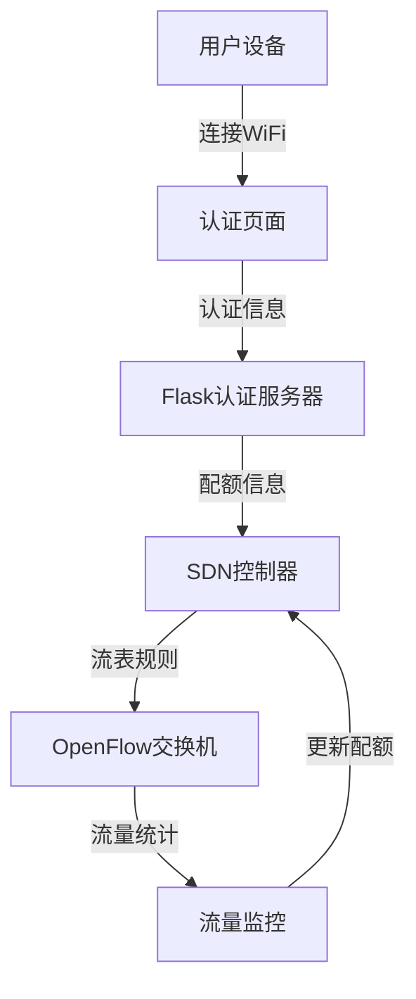
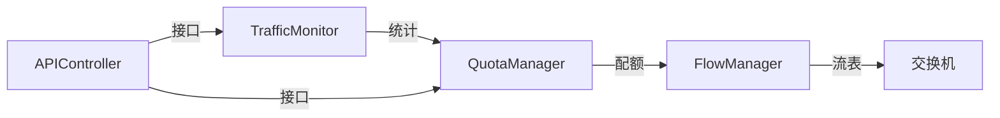
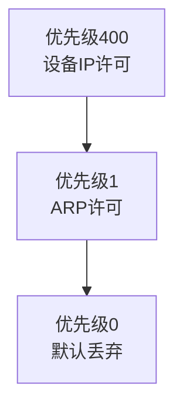
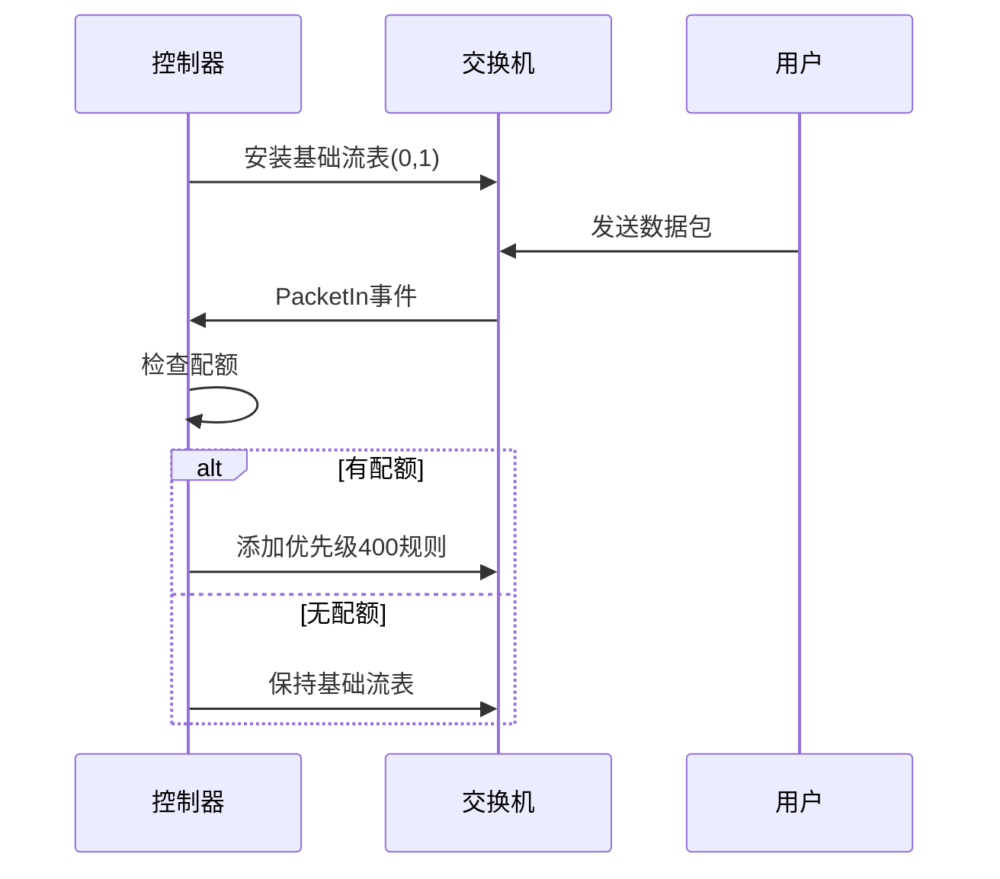
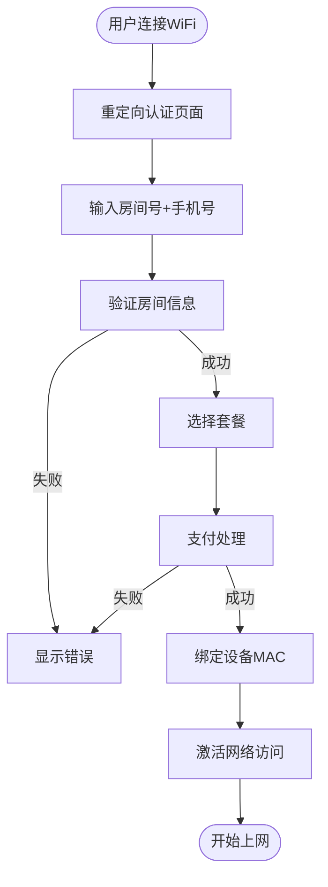

# 📚 酒店WiFi网络控制器 - 技术Wiki

## 🏠 首页
> 基于SDN的酒店WiFi网络管理系统，实现精确的流量配额控制

---

## 📖 目录
1. [系统架构](#系统架构)
2. [流表设计](#流表设计)
3. [流量统计](#流量统计)
4. [认证流程](#认证流程)
5. [API文档](#api文档)
6. [部署指南](#部署指南)
7. [故障排除](#故障排除)
8. [扩展开发](#扩展开发)

---

## 🏗️ 系统架构

### 架构概览


### 核心组件
| 组件 | 端口 | 功能 | 状态 |
|---|---|---|---|
| **SDN控制器** | 6633/8080 | 流表管理 | ✅ 运行中 |
| **认证服务器** | 5000 | 用户认证 | ✅ 运行中 |
| **Mininet** | - | 网络模拟 | ✅ 运行中 |

### 模块关系


---

## 🔧 流表设计

### 流表优先级体系


### 流表规则详解

#### 🔴 优先级0 - 默认丢弃
```python
# 匹配所有未匹配流量
match = OFPMatch()
actions = []
priority = 0
```
- **作用**: 安全默认策略
- **影响**: 阻止所有未授权流量

#### 🟡 优先级1 - ARP通用许可
```python
# 允许所有ARP流量
match = OFPMatch(eth_type=0x0806)
actions = [OFPActionOutput(OFPP_FLOOD)]
priority = 1
```
- **作用**: 网络发现与维护
- **影响**: 允许ARP广播和单播

#### 🟢 优先级400 - 设备IP许可
```python
# 基于配额的设备许可
match = OFPMatch(
    eth_src=device_mac,
    eth_dst=router_mac,
    eth_type=0x0800
)
actions = [OFPActionOutput(router_port)]
priority = 400
```
- **作用**: 基于配额的访问控制
- **影响**: 允许授权设备访问网络

### 流表生命周期


---

## 📊 流量统计

### 统计精度
| 维度 | 精度 | 单位 | 更新频率 |
|---|---|---|---|
| **总流量** | 字节级 | Byte | 实时 |
| **日流量** | 字节级 | Byte | 实时 |
| **剩余配额** | 字节级 | Byte | 实时 |

### 数据流向


### 统计示例
```json
// 用户配额状态
{
  "00:00:00:00:00:01": {
    "room": "101",
    "quota": 10737418240,
    "used": 5242880,
    "remaining": 10732175360,
    "has_quota": true
  }
}
```

---

## 🔐 认证流程

### 完整认证流程


### 认证状态管理
| 状态 | 允许流量 | 流表规则 |
|---|---|---|
| **未认证** | ARP only | 优先级0,1 |
| **已认证有配额** | ARP + IP | 优先级0,1,400 |
| **已认证无配额** | ARP only | 优先级0,1 |

---

## 📡 API文档

### 房间认证API (端口5000)

#### 🔑 房间登录
```http
POST /room_login
Content-Type: application/json

{
    "room_number": "101",
    "phone_last4": "1234"
}

# 响应
{
    "success": true,
    "message": "认证成功",
    "room": "101"
}
```

#### 📱 选择套餐
```http
POST /select_room_plan
Content-Type: application/json

{
    "room_number": "101",
    "plan": "30G"
}

# 套餐选项
# - free: 免费流量
# - 10G: 10GB套餐
# - 30G: 30GB套餐
# - 50G: 50GB套餐
```

#### 🔗 设备绑定
```http
POST /connect_room_device
Content-Type: application/json

{
    "room_number": "101",
    "mac": "00:00:00:00:00:01"
}
```

### SDN控制API (端口8080)

#### 📊 流量查询
```http
GET /traffic
# 响应示例
{
  "00:00:00:00:00:01": {
    "total": 1048576,
    "daily": 524288,
    "room": "101"
  }
}
```

#### 💰 配额状态
```http
GET /quota_status
# 响应示例
{
  "devices": [
    {
      "mac": "00:00:00:00:00:01",
      "room": "101",
      "quota": 10737418240,
      "used": 5242880,
      "remaining": 10732175360
    }
  ]
}
```

---

## 🚀 部署指南

### 开发环境部署

#### 1. 环境准备
```bash
# 安装Python依赖
pip install flask flask-cors requests ryu

# 安装Mininet (Ubuntu/Debian)
sudo apt-get install mininet

# 验证安装
python --version  # >= 3.6
ryu --version     # >= 4.34
```

#### 2. 启动顺序
```bash
# 终端1: 启动SDN控制器
ryu-manager hotel_wifi_controller.py

# 终端2: 启动认证服务器
python flask_room_auth.py

# 终端3: 启动网络拓扑
sudo python mininettopo.py
```

#### 3. 验证部署
```bash
# 检查控制器状态
curl http://localhost:8080/stats

# 检查认证服务
curl http://localhost:5000/health

# 测试网络连通性
sudo mn --test pingall
```

### 生产环境部署

#### 系统服务配置
```bash
# 创建系统服务
sudo tee /etc/systemd/system/ryu-controller.service << EOF
[Unit]
Description=Ryu SDN Controller
After=network.target

[Service]
Type=simple
User=root
ExecStart=/usr/local/bin/ryu-manager /opt/hotel-wifi/hotel_wifi_controller.py
Restart=always

[Install]
WantedBy=multi-user.target
EOF

sudo systemctl enable ryu-controller
sudo systemctl start ryu-controller
```

---

## 🔍 故障排除

### 常见问题速查

#### ❌ 控制器无法连接
```bash
# 检查端口占用
netstat -tulnp | grep :6633

# 重启控制器
sudo systemctl restart ryu-controller

# 查看日志
journalctl -u ryu-controller -f
```

#### ❌ 流量统计异常
```bash
# 检查流量文件
ls -la traffic_stats.json
cat traffic_stats.json | jq .

# 重置流量统计
sudo rm traffic_stats.json
sudo systemctl restart ryu-controller
```

#### ❌ 认证失败
```bash
# 检查房间配置
cat room_auth.json | jq .

# 检查用户数据
cat user_data.json | jq '.users'
```

### 调试命令大全

#### 网络调试
```bash
# 查看流表
ovs-ofctl dump-flows s1

# 查看端口
ovs-ofctl show s1

# 测试连通性
h1 ping -c 3 10.0.0.100
```

#### 服务调试
```bash
# 检查控制器API
curl http://localhost:8080/quota_status

# 检查认证API
curl http://localhost:5000/health

# 查看实时流量
watch -n 1 'curl -s http://localhost:8080/traffic'
```

---

## 🛠️ 扩展开发

### 添加新功能

#### 1. 新套餐类型
```python
# 在quota_manager.py中添加
PLANS = {
    "free": 0,
    "10G": 10 * 1024**3,
    "30G": 30 * 1024**3,
    "50G": 50 * 1024**3,
    "100G": 100 * 1024**3  # 新增
}
```

#### 2. 时间控制
```python
# 在flow_manager.py中添加时间规则
from datetime import datetime

def is_peak_hour():
    hour = datetime.now().hour
    return 8 <= hour <= 22

# 根据时间段调整流表
```

#### 3. QoS控制
```python
# 在流表中添加带宽限制
actions = [
    OFPActionSetQueue(queue_id=1),
    OFPActionOutput(router_port)
]
```

### 数据库升级

#### 从JSON到MySQL
```sql
CREATE TABLE users (
    id INT AUTO_INCREMENT PRIMARY KEY,
    room_number VARCHAR(10) UNIQUE,
    phone_hash VARCHAR(64),
    quota BIGINT,
    used_traffic BIGINT,
    created_at TIMESTAMP DEFAULT CURRENT_TIMESTAMP
);

CREATE TABLE devices (
    id INT AUTO_INCREMENT PRIMARY KEY,
    mac_address VARCHAR(17) UNIQUE,
    room_number VARCHAR(10),
    bind_time TIMESTAMP DEFAULT CURRENT_TIMESTAMP,
    FOREIGN KEY (room_number) REFERENCES users(room_number)
);
```

---

## 📊 监控与告警

### 关键指标监控

| 指标 | 正常范围 | 告警阈值 | 监控命令 |
|---|---|---|---|
| **流表数量** | 2-100条 | >500条 | `ovs-ofctl dump-flows s1 | wc -l` |
| **内存使用** | <500MB | >1GB | `ps aux | grep ryu` |
| **API响应** | <100ms | >500ms | `curl -w "%{time_total}" http://localhost:8080/stats` |
| **流量异常** | <1GB/小时 | >5GB/小时 | 监控traffic_stats.json |

### 自动化监控脚本
```bash
#!/bin/bash
# monitor.sh - 系统监控脚本

while true; do
    # 检查控制器状态
    if ! curl -s http://localhost:8080/stats > /dev/null; then
        echo "$(date): 控制器异常" >> /var/log/hotel-wifi.log
        sudo systemctl restart ryu-controller
    fi
    
    # 检查流量异常
    total_traffic=$(cat traffic_stats.json | jq '.total | length')
    if [ $total_traffic -gt 1000 ]; then
        echo "$(date): 流量异常增长" >> /var/log/hotel-wifi.log
    fi
    
    sleep 60
done
```

---

## 🎯 最佳实践

### 配置管理
- **定期备份**: 每日备份user_data.json和traffic_stats.json
- **版本控制**: 使用Git管理配置文件变更
- **环境分离**: 开发/测试/生产环境独立配置

### 性能优化
- **缓存策略**: 热点数据内存缓存
- **批量操作**: 减少控制器与交换机交互
- **日志轮转**: 避免日志文件过大

### 安全加固
- **HTTPS**: 生产环境使用SSL证书
- **防火墙**: 限制API访问IP
- **监控**: 实时异常流量检测

---

## 📚 相关链接

### 官方文档
- [Ryu控制器文档](https://ryu.readthedocs.io/)
- [OpenFlow规范](https://www.opennetworking.org/technical-communities/areas/specification)
- [Mininet教程](http://mininet.org/walkthrough/)

### 社区资源
- [GitHub项目](https://github.com/Simple-YU-268/Tele4642Proj)
- [问题反馈](https://github.com/Simple-YU-268/Tele4642Proj/issues)
- [贡献指南](CONTRIBUTING.md)

---

**Wiki版本**: v2.1  
**最后更新**: 2025-07-24  
**维护者**: Simple-YU-268  
**许可证**: MIT
